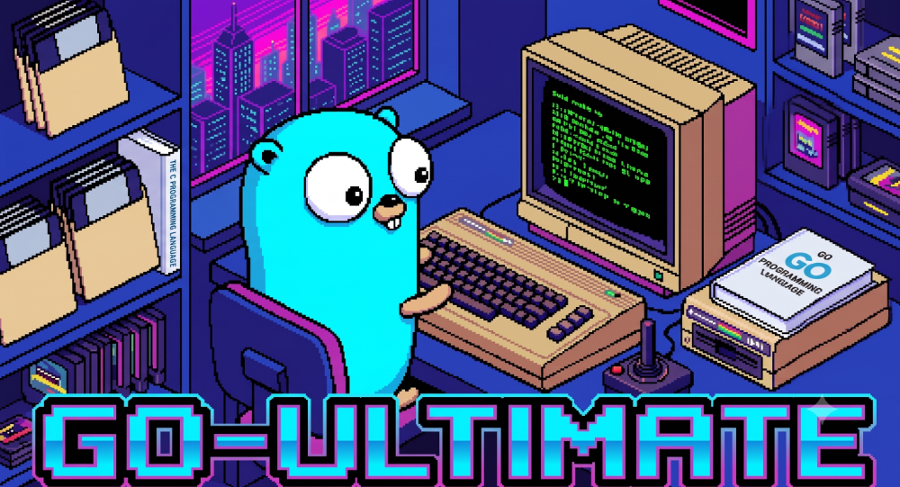

A Go module for controlling Commodore 64 Ultimate devices over the network. It provides client libraries for the device's [REST API](https://1541u-documentation.readthedocs.io/en/latest/api/api_calls.html) and utilities for working with C64 assembly, BASIC, disk and CRT images, streams etc.

## Installation

```bash
go get github.com/c64uploader/go-ultimate
```

## Overview

[](https://pkg.go.dev/github.com/c64uploader/go-ultimate)

See the Go package documentation by clicking the badge above or follow the examples below.

Functionality is organized into the following client services:

*   **[`client.Machine`](examples/machine.go)**: Control power, reset, and read/write RAM over DMA.
*   **[`client.Runners`](examples/runners.go)**: Upload and run programs (.PRG, .CRT) or play music (.SID, .MOD).
*   **[`client.Drives`](examples/files.go)**: Mount disk images and control emulated floppy drives.
*   **[`client.Files`](examples/files.go)**: Query file metadata and create blank disk images.
*   **[`client.Configs`](examples/configs.go)**: Read and write device settings.
*   **[`client.Keyboard`](examples/keyboard.go)**: Inject text into the C64.
*   **[`client.Streams`](examples/streams.go)**: Multiplex video and audio streams into AVI format.
*   **[`client.Debug`](examples/debug.go)**: Read and decode C64 state: screen, registers, memory.
*   **[`client.Raw`](examples/raw.go)**: Send binary commands to the TCP port 64 socket for lower latency than the REST API.

The library also provides utilities for working with 6502 code, BASIC, and C64 hardware:

*   **[`c64.Assemble`](examples/assembler.go)**: Compile 6502 assembly to PRG files.
*   **[`c64.Disassemble`](examples/assembler.go)**: Disassemble 6502 machine code to assembly.
*   **[`c64.NewRAMCartridge`](examples/cartridge.go)**: Build CRT cartridge images.
*   **[`c64.NewDiskImage`](examples/files.go)**: Build D64 or D71 disk images.
*   **[`c64.DecodeBASICProgram`](examples/debug.go)**: Convert tokenized BASIC to source code.
*   **[`c64.ParseT64`](c64/t64.go)**: Parse .T64 tape archive files and extract PRG entries ready for upload.
*   **[`c64.Screen`](examples/debug.go)**: Read and decode live screen text from the C64.
*   **[`c64.Sprite`](examples/debug.go)**: Access sprite position, color, and bitmap data, render to images.
*   **[`c64.DecodeBitmap`](examples/debug.go)**: Render bitmap data to images.

## Contributing

See [CONTRIBUTING.md](CONTRIBUTING.md) for details on how to contribute to this project.
